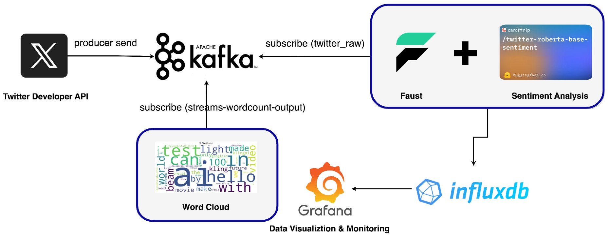
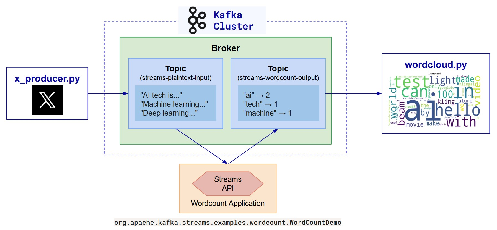
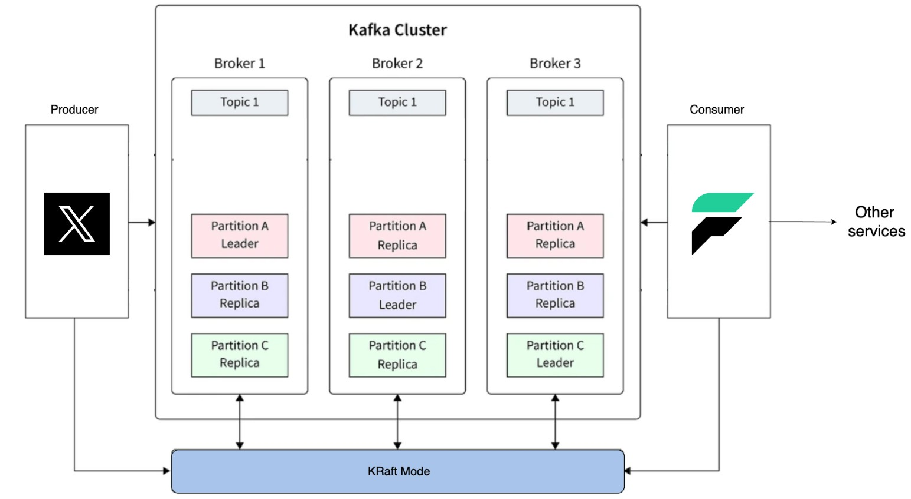

# 🐦 Twitter Sentiment Analysis with Kafka, Faust, and InfluxDB

本專案實作一個以 Kafka 為核心的串流處理系統，提供兩個主要功能：

1. 文字雲生成：統計 Twitter(X) 貼文詞頻並生成文字雲
2. 情緒分析：分析 Twitter(X) 貼文的情緒並可視化

## 系統架構圖

## 專案架構

### 1. 文字雲流程

`twitter_producer.py → Kafka → WordCount Demo → wordcloud_generator.py → 文字雲圖片`

### 2. 情緒分析流程

`producer.py → Kafka topic (tweets_raw)  stream.py (Faust + twitter-roberta-base-sentiment model) → InfluxDB → Grafana`

- **Kafka**：建置三個 broker，實現高可用與高吞吐
- **Faust**：Python stream processing library，作為 Kafka consumer 與處理邏輯
- **Transformers**：使用 `cardiffnlp/twitter-roberta-base-sentiment` 進行情緒分析
- **InfluxDB**：存放分析結果
- **Grafana**：展示情緒分析資料

## 啟動流程

1. 環境變數（.env）
   請建立 .env 並填入以下內容：
   INFLUXDB_URL=http://influxdb:8086
   INFLUXDB_TOKEN=(your_token) （若第一次啟用，請填'mytoken'）
   INFLUXDB_ORG=myorg
   INFLUXDB_BUCKET=tweets

2. 啟動 Kafka containers (Kafka1, Kafka2, Kafka3)

3. 初始化 Kafka topic:
   (在 Kafka 三個 broker 啟動後執行，確保 topic tweets_raw 被正確建立且具備多分區與複本數設定。)
   chmod +x ./init-topics.sh
   ./init-topics.sh

4. 啟動所有其他容器服務（InfluxDB、Grafana、Producer、Faust Stream 等）

5. 開啟 InfluxDB 確認有成功寫入資料：
   前往瀏覽器開啟： http://localhost:8086 （預設帳密 admin / admin123）

6. 開啟 Grafana:
   前往瀏覽器開啟： http://localhost:3000（預設帳密 admin / admin）
   設定 InfluxDB 作為資料來源
   建立 Dashboard，可視化不同情緒類別的 tweet 數量、趨勢等

- [文字雲啟動流程](https://github.com/gahwa17/twitter-sentiment-kafka-stream/tree/main/kafka-worldcount-demo)

## 備註

1. 請先確認 Kafka 三個 brokers 都已啟動，否則 init-topics.sh 無法成功執行
2. 可調整 BATCH_SIZE 與 FLUSH_TIMEOUT 控制分析頻率與即時程度

## 非功能性應用 HeartBeat

1. 藉由發送 HeartBeat 並在失敗時自動以 SMTP 發送 Email 的監控機制得知服務是否故障
2. 設定 .env

- SMTP_USER = 填寫寄件者 email
- SMTP_PASSWORD = 填寫 Gmail 應用程式密碼（需要申請）
- ALERT_TO = 填寫收件者 email

4. 執行 heartbeat.py

## DEMO 與簡報連結

- [Sentiment Analysis](https://youtu.be/QUcHO3FLdDE)
- [Heart Beat](https://youtu.be/P57AWd9K4x0)
